# 源数据与开源溯源记录（Provenance & Licensing Record）

> [!NOTE]
> 本文档记录 **MCP Blog Studio** 所采用的设计资产来源、基准数据快照、知识产权边界、死数据解耦明细以及架构裁剪审计记录。

---

## 1. 源数据基准与抓取记录

| 属性 | 详细记录 |
| :--- | :--- |
| **数据源网站** | `https://innei.in/`（余白 / Yohaku 中文原版） |
| **快照生成时间** | `2026-10-01T01:26:07.421Z` |
| **导入批次标识 (Batch)** | `yohaku-20261001012607` |
| **本地基准归档** | `.local/yohaku-zh/`（含原始页面 HTML、CSS 样式表、字体清单及资源映射） |
| **文章采样规格** | 共采样导入最新 **30 篇**基准文稿，用于验证长文排版、代码块高亮、嵌套列表、复杂表格与目录折叠 |
| **媒体本地化** | 媒体资源通过 Sharp 转换为 WebP 本地化存储于 `public/media/`，建立 URL 到数据库 Media ID 的哈希映射 |

---

## 2. 开源许可证与权利声明

1. **项目许可证**：
   - 本项目整体遵循 **AGPL-3.0** 许可证开发（见项目根目录 [`LICENSE`](file:///Users/wanghong/Projects/personal/mcp-blog-studio/LICENSE) 与 [`ADDITIONAL_TERMS.md`](file:///Users/wanghong/Projects/personal/mcp-blog-studio/ADDITIONAL_TERMS.md)）。
2. **Shiro 源码借鉴**：
   - 上游作者：Innei；
   - 上游仓库：[https://github.com/Innei/Shiro](https://github.com/Innei/Shiro)（固定提交：`891bb24cd59aff7c9baaf4d9a3579ca4275da3b7`）；
   - 本地基于 Payload CMS 架构对相关组件进行了无状态改写，移除了上游 Mix Space 及私有云后端绑定。
3. **Yohaku 设计系统**：
   - 样式变量与设计令牌源自 Innei/Yohaku 公开 design-system 包（`0.0.3`），遵循 **MIT** 许可证（随附于 `src/styles/yohaku/LICENSE`）；
   - 前端组件与动画参数严格遵循该设计系统规范。
4. **文章著作权说明**：
   - 导入的 30 篇基准文章仅用于本地开发、版式验证与端到端测试，其原始内容著作权归原作者所有；
   - 文章底部通过系统内建的「来源溯源」功能提供原始作者与原文链接标识；
   - 本地修改版不作为原作者官方发布版本。

---

## 3. 死数据彻底解耦记录（Dead Data Decoupling）

为了保证博客系统作为通用工作室工作台的独立性，已将原站所有写死的个人私有数据 100% 剥离并转移至 Payload CMS 数据库驱动：

```mermaid
flowchart LR
    subgraph S1["原站死数据 (已剥离)"]
        A1["Innei 个人肖像"]
        A2["原站个人 Bio & Slogan"]
        A3["固定名言（卫星/宇宙）"]
        A4["写死统计（2948天）"]
        A5["硬编码代码导航数组"]
        A6["Innei 个人履历与打赏"]
    end

    subgraph S2["CMS 动态化 (全新方案)"]
        B1["Studio 极简艺术头像 (/avatar.jpg)"]
        B2["Blog Studio / 现代工作流标语"]
        B3["一言 API / 自定义第三方 API 随机拉取"]
        B4["真实字数/篇数聚合 + 自定义建站起始日"]
        B5["Payload Header & Footer 全局可视化配置"]
        B6["关于 MCP Blog Studio 深度技术专题文章"]
    end

    A1 --> B1
    A2 --> B2
    A3 --> B3
    A4 --> B4
    A5 --> B5
    A6 --> B6
```

| 模块 | 原站状态（死数据） | 解耦后状态（CMS 驱动） | 管理入口 |
| :--- | :--- | :--- | :--- |
| **站点品牌** | Innei 个人肖像与名称 | 专属工作室头像与名称 `MCP Blog Studio` | `public/avatar.jpg`、站点设置 |
| **Slogan 标语** | 写死原作者个人产品开发标语 | 动态字段 `heroSlogan`，留空自动隐藏，填写享有动态闪烁光标 | `站点设置` -> 首页 Slogan 标语 |
| **名言金句** | 硬编码固定语句 | 默认接入「一言 (Hitokoto)」开放 API，支持自定义接口、固定文字与关闭 | `站点设置` -> 名言/金句配置 |
| **数据统计** | 写死 `384 篇 · 164 万字 · 2948 天` | 实时计算真实字数与篇数；新增 `siteStartDate` 动态计算开站天数 | `站点设置` -> 建站起始日期 / 统计覆盖 |
| **导航与页脚** | 写死 5 项固定路由数组 | 接入 Payload `Header` 与 `Footer` Global，支持自由增删与排序 | `全局设置` -> 导航 / 页脚设置 |
| **文章置顶** | 代码中字符串匹配硬编码置顶 | 数据库原生 `posts.pinned` 字段与复合索引排序 | `文章` -> 编辑文章 -> 置顶文章 |
| **关于页面** | Innei 个人技能树打分、爱发电与收款码 | 改写为 `关于 MCP Blog Studio` 技术专题文章，移除私有赞助链接 | `站点设置` -> 关于本站（Lexical 富文本） |
| **来源溯源** | 底部写死 `Innei` 兜底 | 增加 `showSourceCredit` 侧边栏开关；原创文章取消勾选后整行隐藏 | `文章` -> 编辑文章 -> 显示来源溯源 |

---

## 4. 动态图表与服务裁剪审计（Omissions & Adaptations）

在 30 篇基准文章转换中，共审计并处理了 **16 处** 动态图表与客户端运行时嵌入点：

1. **Whiteboard（矢量白板）**：
   - **原站原理**：原站在 SSR 时仅输出纯文本占位符，在客户端通过动态加载 `@excalidraw/excalidraw`（Canvas 2D）与远程 JSON 动态计算绘制；
   - **处理方案**：为杜绝不安全的外部远程动态脚本注入风险并保持离线独立性，转换器（`scripts/yohaku/lexical.mjs`）在转换为 Lexical AST 时进行了安全剔除，经审计前后文语义过渡自然，文本连贯完整。
2. **私有云微服务裁剪**：
   - 首页：手记（notes）、碎念（musings）、通信（letters）、动态时间轴、邮件订阅；
   - 正文：AI 摘要、实时在线读者数、点赞、评论区与 49px 评论侧槽；
   - 全站：账号管理操作、多语言切换、工信部备案号、网关健康探针。
   - 以上服务均因架构解耦与保持无状态运行而作了官方裁撤，详见 [`docs/yohaku-conversion.md`](file:///Users/wanghong/Projects/personal/mcp-blog-studio/docs/yohaku-conversion.md)。

---

## 5. 数据完整性与幂等保障

- **去重机制**：导入脚本基于 `importSource.url` 精确去重，重复执行不产生冗余数据；
- **编辑保护**：仅对首轮未修改文章生效；一旦在后台进行过人工编辑，版本号递增，后续脚本均自动跳过，绝不覆盖管理员工作；
- **撤销与软删除**：支持通过 `--undo` 安全移入回收站（Draft 隔离），绝不直接物理抹除数据。
