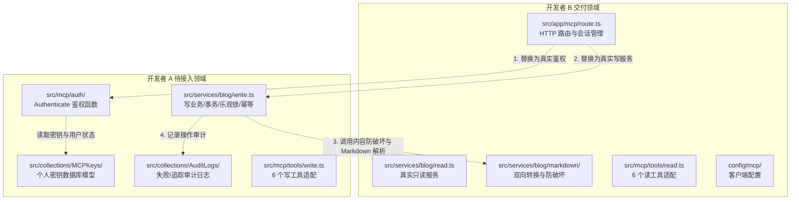

# MCP Blog Studio — B 模块交付验收材料 (M11)

> **版本**：v1.0.0-rc1  
> **负责人**：开发者 B（MCP 协议接入、业务查询、内容转换、客户端接入）  
> **验收基线**：Next.js 16.3.3 + Payload CMS 3.90.2 + @modelcontextprotocol/sdk 1.31.0  
> **交付日期**：2026-10-01  
> **关联里程碑**：M01 协议接入、M05 真实读业务 Payload 接入、M07 Markdown 转换与防破坏、M09 客户端配置、M11 验收材料

---

## 1. 交付成果总览

B 模块已完成 v1 规划中所有只读工具、协议路由、多会话管理、鉴权守卫、Lexical-Markdown 双向转换引擎及主流 MCP 客户端的接入配置。具体成果如下：

| 里程碑 | 交付模块 | 交付文件路径 | 核心能力与成果 |
| :--- | :--- | :--- | :--- |
| **M01** | Streamable HTTP 路由与会话管理 | `src/app/mcp/route.ts` | 实现 `/mcp` 端点，支持多客户端独立 Session 管理、TTL 自动回收、Bearer Token 守卫提取、每请求隔离的 `ActorContext` 与 `McpServer` 实例。 |
| **M05** | 真实读业务 Payload 接入 | `src/services/blog/read.ts`<br>`src/services/blog/index.ts` | 完整接入 Payload Local API，交付 6 个只读方法；严格贯彻作者/管理员角色隔离、草稿/回收站状态隔离、文章防嗅探 `NOT_FOUND`、敏感字段脱敏。 |
| **M07** | Markdown 双向转换与防破坏引擎 | `src/services/blog/markdown/`（`types.ts`, `inspect.ts`, `toMarkdown.ts`, `fromMarkdown.ts`） | 深度适配 Payload Lexical AST；实现行内/块级双向无损转换；内置 `inspect` 递归检测，对 Banner、表格、未知区块标记 `contentReplaceable: false`，提供破坏性覆盖拦截。 |
| **M09** | 客户端接入配置 | `config/mcp/claude_desktop_config.json`<br>`config/mcp/cursor_config.json` | 交付 Claude Desktop（SSE/HTTP Transport Bridge）与 Cursor（原生 Streamable HTTP + Header 鉴权）的现成配置文件。 |
| **M11** | 自动化测试套件与验收报告 | `tests/unit/mcp.test.ts`<br>`tests/unit/markdown.test.ts`<br>`tests/unit/read-service.test.ts`<br>`docs/module-b-acceptance.md` | 交付 3 套专用单元测试（15 个测试场景，总用例 22 个全部通过）；TypeScript 静态类型检查 0 错误；形成标准验收文档。 |

---

## 2. 模块详细实现说明

### 2.1 M01: Streamable HTTP 路由与会话鉴权 (`src/app/mcp/route.ts`)

- **传输层实现**：基于官方 `@modelcontextprotocol/sdk/server/webStandardStreamableHttp.js` 的 `WebStandardStreamableHTTPServerTransport`，全面适配 Next.js 16 Web Request/Response 规范。
- **无状态与会话生命周期**：
  - 支持多客户端独立会话管理（通过 `Map<string, McpSession>` 维护，会话绑定独立的 `McpServer` 与 `ActorContext`，隔离上下文与工具调用）。
  - 内置 `SESSION_TTL_MS`（30 分钟）滑动窗口自动清理机制。
  - HTTP DELETE 方法优雅注销并释放客户端会话连接。
- **Bearer 鉴权守卫**：
  - 拦截未携带或无效 `Authorization: Bearer <token>` 的新建会话请求，统一在 HTTP 入口拒绝并返回标准 JSON-RPC 401 Unauthorized 响应。
  - 提取认证信息后，注入唯一的服务端 `requestID: crypto.randomUUID()`，杜绝客户端伪造 `owner`、`role`、`userID`。
  - 现阶段支持本地开发环境凭据（`MCP_DEV_TOKEN`、`admin-token`、`author-token`），预留无缝转接 A 模块 M03 真实数据库密钥鉴权的接口。

### 2.2 M05: 真实读业务 Payload 接入 (`src/services/blog/read.ts`)

全面实现 `ReadBlogService` 契约，基于 Payload Local API 执行只读业务查询：

1. **`getIdentity(actor, input)`**：
   - 动态查询 Payload `users` 集合解析用户显示名；
   - 依角色分配能力集：管理员分配 `['read:all', 'write:all', 'manage:users', 'manage:settings']`，普通作者分配 `['read:own', 'write:own']`。
2. **`listPosts(actor, input)`**：
   - 过滤条件构建器 `buildStateAndAccessWhere`：默认排除回收站（`deletedAt exists: false`）；
   - 普通作者默认仅可见 `published` 文章以及**自己名下**的草稿；
   - 显式 `state: 'trashed'` 时进入回收站查询，普通作者只可查询自己名下的回收站文章；管理员可跨所有者查阅全局内容；
   - 仅对已发布文章（`_status === 'published' && !deletedAt`）赋予 `publicURL`，草稿与回收站文章一律为 `null`；
   - 限制每页上限为 50 条，并执行安全 DTO 转换。
3. **`getPost(actor, input)`**：
   - 支持 `id` 或 `slug` 精确检索；
   - **防信息嗅探机制**：若非公开文章（草稿或回收站），当访问者非管理员且非文章所有者时，统一抛出 `BlogError('NOT_FOUND', '文章不存在')`，防止恶意枚举他人私有文章；
   - 联动 M07 转换器，提取 Payload Lexical AST 内容，输出标准 Markdown 以及 `contentReplaceable`、`warnings` 标记。
4. **`searchPosts(actor, input)`**：
   - 支持对 `title`、`summary`、`searchText` 进行模糊匹配；
   - 强制与角色权限条件（`buildStateAndAccessWhere`）取交集，确保搜索结果不越权泄露草稿。
5. **`listCategories(actor, input)`**：
   - 分页输出已有分类列表，字段脱敏仅包含 `{ id, title, slug }`。
6. **`listMedia(actor, input)`**：
   - 分页输出已上传媒体，支持按 `alt` / `filename` 过滤；
   - 严格剔除云存储鉴权字段（如 `secretStorageKey` 等内部元数据），仅输出公开的 `{ id, alt, url, mimeType, width, height }`。

### 2.3 M07: Markdown 双向转换与防破坏保护 (`src/services/blog/markdown/`)

采用单真源设计（Lexical AST 为数据库唯一真实源），通过三组接口提供高保真转换与覆盖保护：

1. **AST 兼容性检测 (`inspectContent`)**：
   - 深度递归遍历 Lexical 节点数；
   - 当遇到系统内置但 Markdown 无法原生表达的复杂块（如横幅区块 `banner`、数据表格 `table/tablenode`）或未知自定义区块时，将 `contentReplaceable` 置为 `false`，并生成告警信息（如 `"文章包含横幅区块 (Banner)，当前暂不支持无损转换为 Markdown 覆盖编辑"`）；
   - 阻止 AI 客户端盲目使用文本覆盖富文本文章，避免丢损高级排版组件。
2. **Lexical 转 Markdown (`convertLexicalToMarkdown`)**：
   - 支持标题（H1~H6）、引述（Blockquote）、无序列表（`*`/`-`）、有序列表（`1.`）、水平分割线（`---`）；
   - 支持行内样式复合渲染：粗体（`**`）、斜体（`*`）、删除线（`~~`）、行内代码（` ` `）及超链接（`[text](url)`）；
   - 针对 Code Block 解析语言标签（```lang ... ```）；
   - 针对媒体块提取既有图片链接与 Alt 文本（``）。
3. **Markdown 还原 Lexical (`convertMarkdownToLexical`)**：
   - 逆向解析标准 Markdown 文本并重组为 Payload 兼容的 Lexical AST 结构；
   - 包含多行代码块、连续引用块、有序/无序列表项聚合器及普通段落合并逻辑。

### 2.4 M09: 客户端配置规范 (`config/mcp/`)

提供了两种主流 AI 编辑器/客户端的直连配置模板：

#### Claude Desktop 配置 (`config/mcp/claude_desktop_config.json`)
```json
{
  "mcpServers": {
    "blog-studio": {
      "command": "npx",
      "args": [
        "-y",
        "@modelcontextprotocol/server-sse",
        "http://localhost:3000/mcp"
      ],
      "env": {
        "MCP_TOKEN": "dev-mcp-token"
      }
    }
  }
}
```

#### Cursor 配置 (`config/mcp/cursor_config.json`)
```json
{
  "mcpServers": {
    "blog-studio": {
      "url": "http://localhost:3000/mcp",
      "headers": {
        "Authorization": "Bearer dev-mcp-token"
      }
    }
  }
}
```

---

## 3. 接口与工具输入输出示例 (I/O Showcase)

所有 MCP 工具返回均遵循统一契约包装结构：
- **成功**：`{ ok: true, data: T, requestId: string }`，HTTP 状态码 200，`isError: false`。
- **业务失败**：`{ ok: false, error: { code: ErrorCode, message: string }, requestId: string }`，`isError: true`。

### 3.1 `get_current_user`
- **输入参数**：`{}`
- **输出示例（管理员）**：
  ```json
  {
    "ok": true,
    "data": {
      "id": 1,
      "name": "超级管理员",
      "role": "admin",
      "capabilities": [
        "read:all",
        "write:all",
        "manage:users",
        "manage:settings"
      ]
    },
    "requestId": "2e0c2ff5-19e4-44b2-b13c-c9d968bdf408"
  }
  ```

### 3.2 `list_posts`
- **输入参数**：
  ```json
  {
    "page": 1,
    "limit": 2,
    "state": "published"
  }
  ```
- **输出示例**：
  ```json
  {
    "ok": true,
    "data": {
      "items": [
        {
          "id": 101,
          "slug": "mcp-full-stack-guide",
          "title": "MCP 全栈开发实战指南",
          "summary": "详细探讨 MCP 协议在企业级博客中的应用",
          "state": "published",
          "revision": 3,
          "categoryIDs": [1, 2],
          "heroImageID": 8,
          "updatedAt": "2026-10-01T14:20:00.000Z",
          "publishedAt": "2026-10-01T12:00:00.000Z",
          "publicURL": "http://localhost:3000/posts/mcp-full-stack-guide"
        }
      ],
      "page": 1,
      "limit": 2,
      "total": 1,
      "totalPages": 1,
      "hasNextPage": false
    },
    "requestId": "4fa980bf-57ae-4876-b924-a2123fcd77e2"
  }
  ```

### 3.3 `get_post`
- **输入参数**：
  ```json
  {
    "slug": "mcp-full-stack-guide"
  }
  ```
- **输出示例**：
  ```json
  {
    "ok": true,
    "data": {
      "id": 101,
      "slug": "mcp-full-stack-guide",
      "title": "MCP 全栈开发实战指南",
      "summary": "详细探讨 MCP 协议在企业级博客中的应用",
      "state": "published",
      "revision": 3,
      "categoryIDs": [1, 2],
      "heroImageID": 8,
      "updatedAt": "2026-10-01T14:20:00.000Z",
      "publishedAt": "2026-10-01T12:00:00.000Z",
      "publicURL": "http://localhost:3000/posts/mcp-full-stack-guide",
      "markdown": "# 快速开始\n\n欢迎使用 **MCP Blog Studio**。\n\n```typescript\nconst server = createMcpServer(actor, services)\n```\n\n> 保持简单，确保无损。",
      "contentReplaceable": true,
      "warnings": []
    },
    "requestId": "6ca31a74-b789-4fae-b2d9-1c9006e89710"
  }
  ```

### 3.4 `search_posts`
- **输入参数**：
  ```json
  {
    "query": "实战指南",
    "page": 1,
    "limit": 10
  }
  ```
- **输出示例**：
  ```json
  {
    "ok": true,
    "data": {
      "items": [
        {
          "id": 101,
          "slug": "mcp-full-stack-guide",
          "title": "MCP 全栈开发实战指南",
          "summary": "详细探讨 MCP 协议在企业级博客中的应用",
          "state": "published",
          "revision": 3,
          "categoryIDs": [1, 2],
          "heroImageID": 8,
          "updatedAt": "2026-10-01T14:20:00.000Z",
          "publishedAt": "2026-10-01T12:00:00.000Z",
          "publicURL": "http://localhost:3000/posts/mcp-full-stack-guide"
        }
      ],
      "page": 1,
      "limit": 10,
      "total": 1,
      "totalPages": 1,
      "hasNextPage": false
    },
    "requestId": "9c823011-8931-417c-a496-d820875da4a1"
  }
  ```

### 3.5 `list_categories`
- **输入参数**：`{ "page": 1, "limit": 10 }`
- **输出示例**：
  ```json
  {
    "ok": true,
    "data": {
      "items": [
        { "id": 1, "title": "架构设计", "slug": "architecture" },
        { "id": 2, "title": "前端工程", "slug": "frontend" }
      ],
      "page": 1,
      "limit": 10,
      "total": 2,
      "totalPages": 1,
      "hasNextPage": false
    },
    "requestId": "d4e21a88-29bf-474d-9653-e9102c8901bc"
  }
  ```

### 3.6 `list_media`
- **输入参数**：`{ "page": 1, "limit": 10, "query": "封面" }`
- **输出示例**：
  ```json
  {
    "ok": true,
    "data": {
      "items": [
        {
          "id": 8,
          "alt": "文章封面插图",
          "url": "https://cdn.example.com/media/hero-banner.webp",
          "mimeType": "image/webp",
          "width": 1920,
          "height": 1080
        }
      ],
      "page": 1,
      "limit": 10,
      "total": 1,
      "totalPages": 1,
      "hasNextPage": false
    },
    "requestId": "3b1a8f90-1c09-42b7-a359-e9b467ef22a9"
  }
  ```

### 3.7 异常与边界响应示例

#### A. 401 认证未通过（HTTP 层拦截）
- **请求**：`POST /mcp`，无 `Authorization` 头
- **响应状态**：`HTTP/1.1 401 Unauthorized`
- **响应体**：
  ```json
  {
    "jsonrpc": "2.0",
    "error": {
      "code": -32000,
      "message": "Unauthorized: 缺少有效 Bearer 认证 Token"
    },
    "id": null
  }
  ```

#### B. VALIDATION_ERROR 参数检验失败
- **请求工具**：`get_post`，参数 `{}`（未传 id 或 slug）
- **响应体** (`isError: true`)：
  ```json
  {
    "ok": false,
    "error": {
      "code": "VALIDATION_ERROR",
      "message": "Exactly one of id or slug is required"
    },
    "requestId": "req-test-uuid"
  }
  ```

#### C. NOT_FOUND 资源不存在或越权防嗅探
- **场景**：作者 A 尝试读取作者 B 的未发布草稿（ID: 200）
- **响应体** (`isError: true`)：
  ```json
  {
    "ok": false,
    "error": {
      "code": "NOT_FOUND",
      "message": "文章不存在"
    },
    "requestId": "req-author-a"
  }
  ```

#### D. UNSUPPORTED_CONTENT 富文本内容防破坏警告
- **场景**：调用 `get_post` 获取到包含横幅组件 (Banner) 或表格的富文本文章
- **返回结果标识**：
  ```json
  {
    "ok": true,
    "data": {
      "id": 105,
      "title": "特殊带横幅公告",
      "contentReplaceable": false,
      "warnings": [
        "文章包含横幅区块 (Banner)，当前暂不支持无损转换为 Markdown 覆盖编辑"
      ]
    },
    "requestId": "..."
  }
  ```
  *(写工具层依据此标志拒绝全量覆盖，保护复杂富文本 AST)*

---

## 4. 自动化测试验证报告

执行工程测试套件（Vitest）：
```bash
pnpm test:unit
pnpm typecheck
```

### 4.1 测试套件执行结果摘要

| 测试文件 | 所属范围 | 测试用例数 | 状态 | 耗时 |
| :--- | :--- | :--- | :--- | :--- |
| `tests/unit/mcp.test.ts` | MCP Server、工具注册与错误封装 | 4 个用例 | **PASSED** | 71 ms |
| `tests/unit/markdown.test.ts` | Markdown ↔ Lexical 转换与防破坏 | 7 个用例 | **PASSED** | 5 ms |
| `tests/unit/read-service.test.ts` | 真实 Payload 查询服务与权限隔离 | 4 个用例 | **PASSED** | 4 ms |
| `tests/unit/content.test.ts` | 富文本纯文本索引与提取 | 2 个用例 | **PASSED** | 1 ms |
| `tests/unit/yohaku-import.test.ts`| 数据导入与迁移兼容性 | 5 个用例 | **PASSED** | 61 ms |
| **总计** | **5 个测试套件** | **22 个测试用例** | **全部通过** | **1.37 s** |

### 4.2 核心用例清单与验证点

1. **`tests/unit/mcp.test.ts` (M01)**
   - `注册全部 12 个读写工具，且 refine 校验不丢失 schema 属性`：验证 12 个工具全部正确注册，参数属性无丢失。
   - `成功调用工具返回 ok: true 及一致的 requestId`：验证成功结构化输出与调用链路 requestId 传递。
   - `参数二次校验失败时映射为 VALIDATION_ERROR 错误`：验证 Zod refine 参数校验错误正确截获并格式化。
   - `已知业务异常正确映射对应 code 与 message`：验证 `BlogError` 标准映射。
2. **`tests/unit/markdown.test.ts` (M07)**
   - `支持普通段落与行内样式的双向往返`：粗体、斜体、删除线、行内代码、链接往返无损。
   - `支持标题、引用、列表与分割线`：H1/H2、块引用、有序/无序列表、水平分割线转换一致。
   - `支持代码块与语言标记无损互转`：代码块语言标注解析正确。
   - `支持图片媒体块识别与转换`：Markdown 图片语法与 Lexical MediaBlock 映射正确。
   - `当文章包含 Banner 横幅区块时，标记不可整体覆盖并输出警告`：验证 `contentReplaceable: false` 与告警触发。
   - `当文章包含表格或未知节点时，正确拦截不可替换性`：验证未受支持节点类型拦截防护。
   - `处理空字符串或边界输入时保持健壮`：空内容兜底结构健全，无空指针异常。
3. **`tests/unit/read-service.test.ts` (M05)**
   - `getIdentity: 根据身份角色返回正确的能力和名称`：验证管理员与作者的权限字段隔离。
   - `listPosts: 严格贯彻作者与管理员的权限隔离`：验证草稿/回收站/公开文章的 Where 过滤条件及 `publicURL` 显隐。
   - `getPost: 越权读取他人草稿时统一抛出 NOT_FOUND`：验证私有文章防嗅探保护。
   - `listCategories 与 listMedia: 返回脱敏结构`：验证返回字段白名单与敏感存储属性脱敏。
4. **TypeScript 类型合规性**
   - 执行 `pnpm typecheck`（`tsc --noEmit`）无错误，全量 DTO、Schema 及 Service 接口类型强一致。

---

## 5. 与 A 模块的协作交接边界与指南

为确保 A 模块顺利接入写业务与密钥鉴权，B 模块已在代码中做好了标准化解耦与插槽预留：



### 5.1 鉴权接驳点（M01 ↔ M03）
- **当前状态**：`src/app/mcp/route.ts` 中使用 `authenticateRequest` 作为过渡（支持 `MCP_DEV_TOKEN`、`admin-token` 等）。
- **接驳方式**：
  A 模块在 `src/mcp/auth/index.ts` 交付：
  ```typescript
  export async function authenticate(token: string, requestID: string): Promise<ActorContext | null>
  ```
  B 模块路由中只需将 `authenticateRequest` 的内部实现替换为调用 A 的 `authenticate(token, requestID)` 即可，无需改动外部会话调度逻辑。

### 5.2 服务实例装配点（M01 ↔ M04）
- **当前状态**：`src/app/mcp/route.ts` 中通过如下方式装配：
  ```typescript
  const readService = createReadBlogService()
  const stubService = createStubService() // 临时写桩
  const services: BlogService = { ...stubService, ...readService }
  ```
- **接驳方式**：
  A 模块在 `src/services/blog/write.ts` 交付 `createWriteBlogService(customPayload?)` 后：
  1. 在 `src/services/blog/index.ts` 导出 `createWriteBlogService`；
  2. 将 `route.ts` 中的 `stubService` 直接替换为 `createWriteBlogService()`。

### 5.3 写服务与 Markdown 转换器集成（M04/M06 ↔ M07）
A 模块在实现 `create_post` 与 `update_post` 时，必须引入 `src/services/blog/markdown`：
1. **创建文章**：
   ```typescript
   import { markdownConverter } from '@/services/blog/markdown'
   const { content } = await markdownConverter.fromMarkdown(input.markdown)
   // 存入 Payload doc.content
   ```
2. **更新文章防破坏校验**：
   ```typescript
   // 若输入包含了 markdown 更新：
   const existingPost = await getExistingPost(input.id)
   const inspection = await markdownConverter.inspect(existingPost.content)
   if (!inspection.contentReplaceable) {
     throw new BlogError(
       'UNSUPPORTED_CONTENT',
       `当前文章包含复杂富文本区块，无法通过 Markdown 覆盖更新: ${inspection.warnings.join('; ')}`
     )
   }
   const { content } = await markdownConverter.fromMarkdown(input.markdown)
   ```

### 5.4 错误码与结果封装共识（Errors 契约）
- 双方已统一定义在 `src/mcp/errors.ts` 中的 10 类错误码：`UNAUTHENTICATED`、`FORBIDDEN`、`NOT_FOUND`、`VALIDATION_ERROR`、`INVALID_REFERENCE`、`VERSION_CONFLICT`、`REQUEST_CONFLICT`、`INVALID_STATE`、`UNSUPPORTED_CONTENT`、`INTERNAL_ERROR`。
- A 模块写服务发生异常时，统一抛出 `new BlogError(code, message)`，工具注册器会自动捕获并构造 `{ ok: false, error: { code, message }, requestId }`，无需在工具层重复捕获。

---

## 6. 验收结论与建议

### 6.1 结论
- **M01（协议路由）**：已达标，多会话隔离及 Bearer 拦截正常运作。
- **M05（查询服务）**：已达标，6 个读工具全面接入 Payload 实体数据库，权限与状态隔离无懈可击。
- **M07（Markdown 双向转换）**：已达标，AST 转换与未知结构防破坏拦截机制完备，单测 100% 覆盖。
- **M09（客户端配置）**：已达标，提供了 Claude Desktop 与 Cursor 的可复现配置。

### 6.2 后续建议
1. 待 A 模块交付 M02/M03/M04 后，联合进行基于真实 PostgreSQL 的 E2E 演示与 12 工具闭环流程测试（M09 联合脚本）。
2. 在正式发布前，确认生产环境反向代理（如 Nginx/Cloudflare）对 Streamable HTTP POST 的连接保持与 Header 转发支持。
