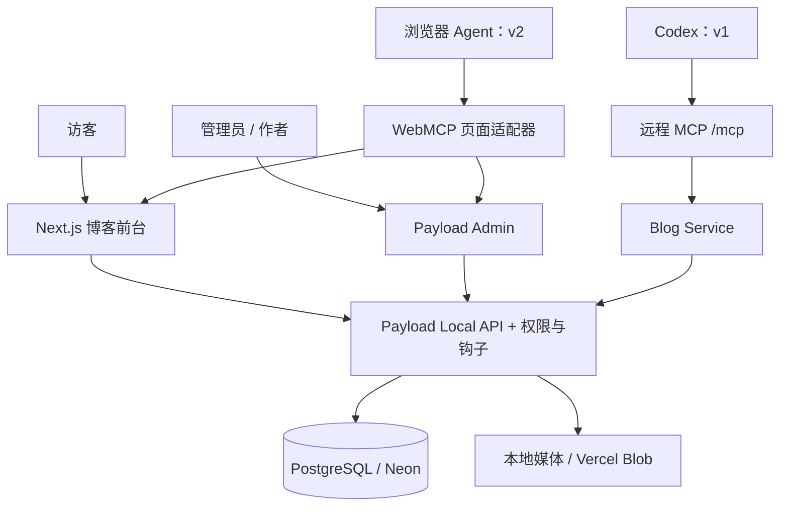

# 技术设计

日期：2026-09-30。标记为 v0 的描述对应当前实现；v1、v2 为待实施设计。产品版本与 SDK 主版本独立。

## 1. 总体架构



共享数据库和访问规则。前端不能直接连接数据库；MCP 不另建 CRUD 数据层；WebMCP 不把浏览器变成持有服务端密钥的代理。

## 2. v0 当前实现

### 技术与目录

- Next.js 16.3.3、React 19.2.6、Payload 3.90.2、TypeScript、Tailwind CSS；具体依赖以 `package.json` 和锁文件为准。
- `src/app/(frontend)`：首页、文章、分类、搜索、关于及预览。
- `src/app/(payload)`：Payload 后台与 REST/GraphQL 接口。
- `src/collections`、`src/globals`、`src/access`：模型、全局配置和权限。
- `src/services`：公开查询、正文纯文本提取、媒体保护、审计。
- `src/migrations`：显式迁移；`scripts`：初始化与本地示例数据；`tests`：验证。

### 模型

| 模型 | 关键字段 | 说明 |
| --- | --- | --- |
| Users | name、email、role、active | role 为 admin/author；禁止公开创建，作者不能修改角色和激活状态 |
| Posts | title、slug、summary、content、owner、authors、categories、heroImage | 所有者控制权限，authors 用于展示 |
| Posts 状态 | `_status`、deletedAt、revision、publishedAt | 显式草稿/发布状态，原生回收站，整数并发版本号 |
| Posts 索引内容 | searchText | 从富文本提取正文和代码，不能由调用方自由覆盖 |
| Media | owner、alt、caption、文件及尺寸信息 | 图片公开读取，写入仅本人或管理员 |
| Categories | title、slug | 公开读，管理员写 |
| SiteSettings | title、description、about | 全站信息，管理员写 |
| Header / Footer | navItems | 导航配置，管理员写 |
| AuditLogs | actor、action、target、source、result、code | 内部追加、对外只读；目前记录成功的文章写操作 |

模板保留 Pages、SEO、重定向和表单基础结构，但隐藏非核心后台导航，禁用公开表单提交。首页及关于页使用固定路由和 SiteSettings，不把任意模板页面当作首版核心模块。

### 内容保存与冲突

1. 请求通过集合访问规则，确定是否有当前文章的写权限。
2. 钩子统一作者归属、状态、正文索引和发布日期。
3. 文章更新必须处于 Payload PostgreSQL 事务；锁定当前文章行，比较提交的 `revision`。
4. 相同版本才允许写入，并将版本号加一；不相同返回 409。
5. 文章、版本与成功日志使用同一请求事务；提交后由框架按请求生命周期刷新相关页面/缓存。

v0 使用独立 `_status` 字段配合普通历史版本，而非原生草稿自动保存分支，从而使已发布文章的普通保存立即更新公开内容。恢复回收站或历史版本时强制回到草稿。恢复历史版本使用读取到的当前版本号参与锁校验，保留当前所有者与 slug。

为了避免删除图片与新建引用竞争，内容写入和媒体删除使用同一个 PostgreSQL 事务级 advisory lock。该策略优先保证 Demo 正确性，会串行化相关写请求；大量并发场景应改为更细粒度引用表和锁策略。

### 查询与公开内容

- 公开查询同时要求 `_status = published` 且未回收，显式 `overrideAccess: false`。
- 搜索直接查询 Posts 的 title、summary、searchText，避免独立搜索副本下架后仍泄露摘要。
- 首页、列表、分类、详情和搜索动态读取数据库；站点地图使用标签失效处理。
- 草稿预览必须同时具备预览密钥、后台会话和目标文档访问权；浏览器 draft mode 不是授权凭据。
- 公开作者信息只输出显示名，不把用户邮箱或认证数据序列化到前台。

### 媒体与日志

本地存储在被 Git 忽略的 `public/media`。云端适配器字段始终进入 schema，是否使用 Blob 取决于环境配置。真实 Blob 上传仍需云资源验收。

删除保护检查当前文章和页面的媒体引用，包括草稿与回收站。不会永久保留所有历史版本引用的文件；这一行为在需求中明确记录。

v0 审计记录成功写入；v1 增加工具请求及失败记录。失败日志不能放在已经回滚的内容事务中，否则错误证据会一并丢失。

## 3. v1 MCP 设计（规划）

### 分层和依赖方向

```text
/mcp HTTP route
  → bearer authentication → ActorContext
  → MCP SDK server → schema validation
  → tools/read.ts / tools/write.ts
  → BlogService
  → Payload Local API（overrideAccess: false，显式 user/req）
  → collection access + hooks + PostgreSQL
```

当前工作区已有 `src/mcp` 的契约/注册骨架及 `src/services/blog` 的接口骨架，业务、HTTP 接入、个人密钥集合及后台管理入口尚待实现；不代表远程 MCP 已可用。逐模块实现指南见 [双人分工第 8–10 节](work-allocation.md#8-先了解当前进度与架构)。只新增独立路由，不修改 Payload 生成路由来塞入 MCP 逻辑。

### 服务契约

业务层以认证后的 `ActorContext` 为调用前提，内容包括 `userID`、`role`、`keyID`、`requestID`、`source`。上下文仅由服务端鉴权模块生成，客户端参数不允许传 owner、role 或任意 Payload where 表达式。

BlogService 暴露：getIdentity、listPosts、getPost、searchPosts、createPost、updatePost、publishPost、unpublishPost、trashPost、restorePost、listCategories、listMedia。

服务层拥有数据和状态语义；工具层仅负责参数映射、SDK 注册和结果包装。接口及 DTO 由双方先共同冻结，再各自实现；详见工具契约与分工。

### 传输和安全

- 基于官方 MCP SDK 的 Streamable HTTP，每个请求构建服务端认证上下文；不依赖进程内会话保持正确性。
- v1 不需要服务端主动通知、长任务或双向 sampling，优先普通 JSON 响应。
- 初步兼容基线为 2025-11-25 协议，实施时由 SDK 协商并锁定实际验证的 SDK/协议/客户端组合；不把文档草案直接当作已支持接口。[传输规范](https://modelcontextprotocol.io/specification/2025-11-25/basic/transports)
- 密钥为高熵随机值，存储摘要、前缀、owner、label、createdAt、revokedAt；创建响应 `no-store`，明文仅展示一次。
- 每次请求重新读取用户角色与状态；密钥或用户被撤销后不可复用旧权限。
- 无效认证返回 HTTP 401，协议错误交给 SDK，已认证工具失败按统一业务错误返回。
- 检查请求 Origin（有值时）及 Host 白名单；不接受通配任意来源，不把 token 放在 URL。
- 密钥创建和撤销仅通过受保护后台接口完成，需要会话、所有者/管理员权限与同源保护。

**个人密钥是本 Demo 与 Codex 的限定接入方案，不宣称等价于标准 OAuth 授权服务器。** 如果后来增加需要授权发现的客户端，单独扩展 OAuth 相关元数据与流程，不伪造兼容性。[MCP 授权规范](https://modelcontextprotocol.io/specification/2025-11-25/basic/authorization)

### 内容转换

仅保存富文本一个真源。Markdown 支持标题、段落、强调、引用、列表、链接、图片、代码和分隔线。图片复用媒体库，不提供远程任意 URL 下载器。

读取返回 Markdown、warnings、contentReplaceable。遇到未知区块、不能保留的格式或未解析媒体时标记不可整体替换；元数据更新仍允许。必须测试 Markdown → 富文本 → Markdown 往返，不采用仅“能解析”就判定无损的标准。

### 写入和重试

写入既有文章必须提交 `expectedRevision`。创建增加 `requestId`，以 `(actorID, requestId)` 唯一记录处理结果和输入摘要；完全相同的重试返回原结果，相同 ID 不同内容返回冲突。其他写请求沿用版本冲突保护，不对不确定失败自动重复执行。

成功日志和写入同事务；失败记录在回滚后独立追加，标记 requestID 和稳定错误码，不持久化完整正文与密钥。审计写入失败应进入服务端错误日志，不能把未记录的成功错误地描述为已审计完成。

## 4. v2 WebMCP 设计（规划）

### 兼容层与工具生命周期

截至本次核查，Chrome 官方 Imperative API 使用 `document.modelContext`；它仍有试验与版本变化约束。v2 开始时重新核对文档、目标浏览器与开关/试验条件，不沿用旧示例硬编码 `navigator.modelContext`。[Chrome 官方接口文档](https://developer.chrome.com/docs/ai/webmcp/imperative-api)

新增薄适配器统一 feature detection、注册、撤销和取消。以当前页面挂载周期注册对应工具，卸载时清理；执行前检查页面和资源是否仍然有效。浏览器不支持时返回普通页面，不抛全站错误。

### 页面状态与授权

- 搜索、分类和分页写入 URL 状态，再用现有页面查询路径渲染；无需另一份数据源。
- 打开文章通过 slug/ID 查得本站路径，禁止工具接收任意外部跳转地址。
- 编辑器/草稿预览先用同源用户会话验证资源访问权，不把个人 MCP token 暴露到网页。
- 滚动仅作用于当前文章存在的标题锚点。工具返回锚点未找到时不能报告成功。
- 页面工具更改可见状态，并在完成或导航交接时按浏览器接口语义返回。取消请求不能继续触发后续跳转。
- 不修改 Payload 核心依赖；后台页面能力通过受支持的自定义组件扩展。

### 与 v1 的关系

v1 和 v2 各自有工具入口，复用内容权限但不共用密钥。v2 首版不注册数据库写工具。联合演示可由 Codex 完成远程发布，再由支持 WebMCP 的浏览器 Agent 完成页面操作；不假定 Codex 自带浏览器 WebMCP 能力。

## 5. 实施约束

- schema 变更附带迁移与生成类型，迁移一次执行；共同文件由单一负责人合并。
- 所有服务端 Local API 调用明确权限意图；少数内部审计追加、受控初始化或公开作者名投影的权限绕过要有注释和限定输入。
- 当前权限与事务依赖 Payload/Drizzle 的具体版本；升级后必须运行数据库和浏览器回归。
- 业务所有权转移、历史版本恢复、分页边界和 Blob 客户端上传列入进一步回归，不因构建通过而视为上线完成。

## 前台设计与模块适配

前台继承极简纸面美学与留白质感。新增 SiteSettings.brandImage 和 socialLinks，由数据库迁移管理。源码包由构建前脚本自动生成，公开页脚提供下载入口。
