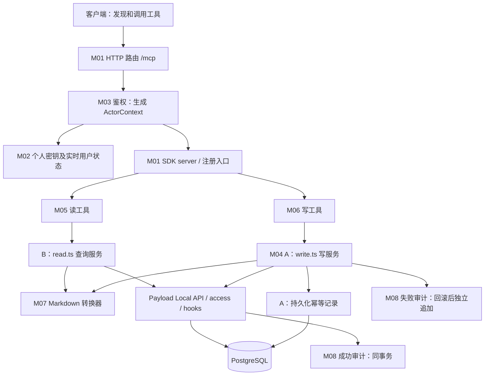

# 双人分工与协作方案

版本：2026-10-01。仅用“开发者 A / 开发者 B”表示责任域，不预先指定人员；两位可按技能自行认领。

## 1. 推荐分工

**A：身份权限、业务写入、数据库与审计。**

**B：MCP 协议接入、业务查询、内容转换、客户端及页面联调。**

这样分可让每个核心模块有唯一负责人，同时把高风险写入集中到一侧。双方先确定契约，各自用桩或模拟服务开发，避免等对方完整实现后才开始。

这不是“一个人只写后端、另一个人只写文档”。双方都交付代码、测试、说明，并互相 review。工作量以可验收模块衡量，不按工具数量机械平分。

## 2. 各版本职责

| 版本 | A 主责 | B 主责 | 共同验收 |
| --- | --- | --- | --- |
| v0 普通博客 | 模型、管理员/作者权限、迁移、媒体引用保护、并发与回收站 | 前台模板适配、搜索/分类/详情体验、响应式、浏览器验证 | 作者隔离、发布后可见、用户视觉验收 |
| v1 MCP | 密钥、鉴权、写业务、6 个写工具、操作审计、数据库迁移 | 远程协议、6 个读工具、Markdown 转换、Codex 接入与演示 | 12 工具闭环、越权/冲突/重试、部署 |
| v2 WebMCP | 后台编辑/预览授权、服务端接口、会话安全、权限回归 | 浏览器适配器、页面工具、生命周期、可见状态与降级 | v1 + v2 联合演示和真实浏览器测试 |

v0 普通博客由 Codex 完成并交付；两位开发者接续 v1/v2。表中 v0 分工保留为模块维护边界。v1 的功能实施按双方确认的里程碑推进；当前已有骨架不等于 v1 完成，本次文档修订不自动扩展为功能编码。

## 3. v1 按模块拆分

| 模块 | 负责人 | 交付物 | 依赖 | 完成标准 |
| --- | --- | --- | --- | --- |
| M01 协议接入 | B | `/mcp` 路由、SDK transport、注册入口、协议测试 | ActorContext 契约 | 初始化、工具发现、调用、错误和关闭正确 |
| M02 个人密钥 | A | 密钥集合、摘要、创建/撤销接口、后台入口、迁移 | Users | 明文仅出现一次，撤销立即生效，不可冒领他人密钥 |
| M03 鉴权 | A | Bearer 校验、实时用户状态、服务端上下文 | M02 | 用户停用/角色变更可即时限制访问 |
| M04 写业务 | A | 创建/更新/状态迁移、并发控制、持久化幂等记录与迁移 | v0 内容钩子、转换器接口 | 不越权、不重复创建、不覆盖新版本 |
| M05 查询工具 | B | 身份、文章列表/详情/搜索、分类、媒体 6 工具 | 查询权限、DTO | 返回分页和安全字段，不泄露草稿 |
| M06 写工具 | A | 创建/更新/发布/下架/回收/恢复 6 工具适配器 | M04、B 的注册接口 | 参数白名单、状态和输出契约一致 |
| M07 内容转换 | B | Markdown ↔ 富文本、兼容检查、固定样本及单测 | Payload 富文本模型 | 支持格式往返，未知区块禁止整体替换 |
| M08 审计 | A | 成功/失败记录、requestId、脱敏、后台查看 | M03/M04 | 失败回滚后仍有可追踪记录，不存正文或密钥 |
| M09 客户端联调 | B | Codex 配置示例、演示脚本、协议验收记录 | M01/M05/M06 | 真实客户端完成 12 工具演示 |
| M10 发布 | A | 迁移执行、环境检查、备份/回退步骤 | 共同测试通过 | 线上环境隔离，构建/迁移可复现 |
| M11 验收材料 | B | 操作截图、演示步骤、已知问题与验收记录 | M09/M10 | 任何一人照文档可重现结果 |

### 12 个工具明确归属

- **A（写）**：create_post、update_post、publish_post、unpublish_post、trash_post、restore_post。
- **B（读）**：get_current_user、list_posts、get_post、search_posts、list_categories、list_media。

审核配对：B 审 A 的写工具是否遵守协议契约；A 审 B 的查询、转换和路由是否绕过权限。作者越权、幂等及并发场景共同审查。

## 4. 文件与共享边界

以下为 v1 目标目录；当前已有部分骨架，实际状态见第 8 节，文件存在不代表功能完成：

| 责任域 | A 修改 | B 修改 |
| --- | --- | --- |
| 认证/数据 | `src/collections/MCPKeys/**`、`src/mcp/auth/**`、`src/services/blog/write.ts` | `src/services/blog/read.ts`、`src/services/blog/markdown/**` |
| 工具 | `src/mcp/tools/write.ts` | `src/mcp/tools/read.ts`、`src/mcp/server.ts`、`src/app/mcp/route.ts` |
| 后台/展示 | 密钥管理组件、审计集合 | 接入示例、演示文档、v2 页面组件 |
| 测试 | auth/write/audit 数据库集成测试 | protocol/read/conversion/client 测试 |

共同文件由单一负责人合并：

- A：`src/mcp/contracts.ts`（双方确认后统一维护）、Payload 配置、数据集合、迁移与生成类型。
- B：`package.json`、依赖锁文件、SDK 注册入口、`src/mcp/tools/register.ts`、`src/mcp/errors.ts`、`src/services/blog/index.ts` 组装入口、文档导航。错误码含义由双方确认后维护。
- 双方不要并行生成迁移或重写同一份锁文件。需要修改共同契约时，先发出变更说明，再由负责人更新。
- 不修改 `node_modules` 或手写 Payload 生成文件；生成类型和 import map 由固定命令更新。

## 5. 如何减少等待

### 联调前置交付

第一次同步结束前，共同确认：

1. ActorContext 的字段和来源；API 不能接收客户端伪造身份。
2. PostSummary / PostDetail / PageResult、工具参数、状态和错误码。
3. 转换器 `inspect / toMarkdown / fromMarkdown` 三接口、媒体解析依赖与四种固定内容样本。
4. 工具注册函数签名：`registerReadTools(server, services, actor)` 与 `registerWriteTools(server, services, actor)`。
5. 共享测试角色：admin、authorA、authorB，数据仅写入隔离环境。

### 并行顺序

| 轮次 | A 可独立做 | B 可独立做 | 汇合点 |
| --- | --- | --- | --- |
| 1 | 密钥模型、鉴权、写业务接口 | SDK 路由、模拟工具与转换器 | 身份工具可真实调用 |
| 2 | 创建/更新、版本冲突、审计 | 6 个读工具、内容转换测试 | 创建草稿后可从 MCP 读取 |
| 3 | 发布/下架/回收/恢复、创建幂等 | Codex 接入、错误展示、分页/媒体联调 | 完整文章生命周期 |
| 4 | 权限回归、迁移和发布准备 | 真实客户端演示、文档及浏览器回归 | 共同发布签核 |

预计工作量仅用于排期讨论：v1 A 约 6–8 人日、B 约 6–8 人日，再预留 2–3 个共同工作日处理联调和回归。以 v0 已验收为前提，不含云账户审批、模板等待或平台故障；不是交付日期承诺。

## 6. PR 与完成定义

- 一个 PR 对应一个模块或可独立验收的子集，写明问题、行为变化、验证结果。
- 第一个 PR 固定契约及桩实现；之后读/写工具分别拆 PR，避免一次合并整套服务器。
- 作者运行对应单测与集成测试；另一人 review 后合并。修改权限、状态或模型时补充反例测试。
- 不在同一数据库上各自尝试不兼容迁移；开发者各自独立数据库，联调库由 A 管理。
- 每次交接提供可运行分支、接口版本、测试账号取得方式、测试命令和限制，不通过聊天直接传长期生产密钥。
- “完成”同时包括实现、测试、文档和对端可调用；仅代码编译通过不算联调完成。

## 7. 工作量不均时的调整

若 A 的权限和幂等工作成为瓶颈，B 可接手固定样本、写工具黑盒测试及后台密钥入口的界面部分；核心鉴权/数据写入仍由 A 统一维护。若 B 的转换器复杂度超预期，先收窄支持格式，不允许用静默删内容赶进度。

两位认领角色后，可只在文档顶端补充“负责人 A/B”姓名，无需重新拆分技术边界。

## 8. 先了解当前进度与架构

### 当前代码核查（2026-10-01）

本节记录本次工作区快照；已有 MCP 文件和依赖变更尚未提交，不代表已通过验收。本次只修订文档，不推进 MCP 功能编码。

| 部分 | 当前实际状态 | 接下来要做 |
| --- | --- | --- |
| `src/mcp/contracts.ts` | 已定义 ActorContext、12 个输入/输出 schema、BlogService 类型 | 双方确认错误封装、媒体解析和服务组装契约 |
| `src/mcp/server.ts`、`tools/*.ts`、`errors.ts` | 已有 server 工厂、12 个工具注册和错误包装骨架 | 完善校验错误分类、输出约束、协议测试 |
| `src/mcp/auth/index.ts` | 只有 Authenticate 类型 | 实现密钥验证、撤销和实时用户查询 |
| `src/services/blog/index.ts` | 仅导出服务类型 | 实现 read/write 与服务实例组装 |
| `src/services/blog/markdown/index.ts` | 只有转换器接口 | 实现转换、兼容检测和媒体解析 |
| HTTP 入口、个人密钥、幂等持久化 | 尚无对应实现 | 新增路由、集合、迁移及后台入口 |
| v0 Posts、权限、审计 | 已有实现可复用 | MCP 接入事务；补追踪字段与失败审计 |

### 一次工具调用经过哪些模块

职责记法：**路由处理 HTTP，SDK 处理 MCP，工具适配参数，服务执行业务，Payload 执行权限与数据钩子，数据库保证原子性。** 不在工具回调里直接拼 SQL 或另写一套文章权限。

v1 交付范围是 12 个 tools。Resources、Prompts、sampling 和独立 Agent 推理循环不属于首版必需模块；客户端负责选择工具，服务器负责可靠执行。v2 页面工具另行实施。

## 9. 模块详细编写指南

### M01 协议接入与服务组装（B）

**入口/产物：** 新增 `src/app/mcp/route.ts`，复用 `src/mcp/server.ts`，由 B 维护 `src/services/blog/index.ts` 的组装入口。A/B 各提供写/读服务实现，组装模块只注入依赖，不承载业务逻辑。

1. 先阅读本地 `node_modules/next/dist/docs/01-app/01-getting-started/15-route-handlers.md`。当前 Route Handler 使用 Web Request/Response；不要将其强转成 Node IncomingMessage/ServerResponse。
2. 当前安装 SDK 1.31.0 提供 `WebStandardStreamableHTTPServerTransport`，可从 `@modelcontextprotocol/sdk/server/webStandardStreamableHttp.js` 使用。实现前核对本地类型声明；选 Node.js runtime 以兼容 Payload/PostgreSQL。
3. 首版使用无状态 transport（不设置 sessionIdGenerator）与 JSON 响应（enableJsonResponse）。每个请求新建 server/transport，绑定该请求 actor；禁止全局缓存带身份的 server。
4. HTTP 入口先做 Host/Origin 校验、生成服务端 requestID、Bearer 鉴权，再创建服务并交给 SDK。Origin 缺失的原生客户端仍需鉴权；非法 Origin 应拒绝。SDK 内置 Host/Origin 选项已标记弃用，校验放路由或中间件。
5. POST 交给 SDK 处理初始化、通知、工具发现及调用；无 SSE/会话的首版对 GET/DELETE 明确返回 405。不要自行实现 JSON-RPC 分发或把通知都包装成普通工具结果。覆盖 Accept、协议版本、请求体大小、异常和连接释放。
6. 私有响应明确 no-store；完成响应后释放实例，避免提前关闭仍在输出的响应。HTTP 错误、JSON-RPC 错误、业务错误分层处理。

**验收：** 真实 HTTP 路径完成 initialize → tools/list → tools/call；两个不同用户并发调用不串身份；非法认证不能进入服务；断连/异常可释放资源。仅能通过内存 transport 测试还不算完成。

### M02 个人密钥（A）

**入口/产物：** 拟新增 `src/collections/MCPKeys/`、受会话保护的创建/撤销接口与后台组件；集合注册、迁移和生成类型由 A 一并交付。

- 使用密码学安全随机值生成高熵密钥；库内仅保存摘要、显示前缀、owner、label、创建时间和撤销时间。摘要不进入公开 DTO，明文只在创建响应显示一次。
- owner 从后台登录用户获取；作者只能管理自己的密钥。管理员管理范围必须在服务端判断，不能依赖隐藏按钮。
- 创建/撤销接口校验后台会话和同源请求；一次性明文响应 no-store，禁止进入日志。关闭窗口后不能再次读取明文，丢失时创建新密钥并撤销旧密钥。

**验收：** 创建后可认证；他人不能查看或撤销；撤销后的下一次请求失败；数据库与日志无明文密钥。

### M03 身份与请求上下文（A）

**现有接口：** `Authenticate(token, requestID) → Promise<ActorContext | null>`。成功返回 userID、role、keyID、requestID、source='mcp'；失败由路由映射为 HTTP 401。

- 每次请求读取密钥及当前用户，检查撤销、active、当前角色。不要把密钥创建时的角色当永久权限。
- `ActorContext` 只用于可信服务端传递；TypeScript 的 readonly 不能代替认证。禁止从工具参数拼出身份。
- 服务层通过受信任的 userID 获取 Payload 用户，在 Local API 中显式传入 user/req 与 `overrideAccess: false`。约定 req.context.source='mcp' 及追踪字段；不得将带事务的 req 跨请求共享。
- **区分两种 ID：** actor.requestID 是服务端每次 HTTP 请求的追踪标识；create_post 输入 requestId 是客户端创建幂等键。重试可有新的追踪 ID，但必须保留同一个创建幂等键。

**验收：** 停用用户、变更角色、撤销密钥即时影响后续请求；伪造 owner/role 参数无法提升权限。

### M04 写服务、事务与幂等（A）

**入口/产物：** 拟新增 `src/services/blog/write.ts`，实现 WriteBlogService 的 6 个方法；新增幂等记录集合或内部表及迁移，名称由 A 在首个实现 PR 固定。

**创建流程：** 校验输入 → 确认当前身份 → 规范化输入并计算摘要 → 开启事务并占用 `(userID, requestId)` 唯一键 → 校验引用与转换内容 → Payload 创建草稿 → 保存原始成功 DTO → 同事务提交。

- 规范化规则必须固定：对象键排序、默认值处理一致；不得 trim/改写正文后再比较不同输入。唯一键必须由数据库保证，不能先查不存在就直接创建。
- 并发相同请求只允许一次创建；唯一键冲突时正确处理已失败事务，再读取已提交记录并比对摘要。相同输入返回原始成功 DTO，不返回后来被编辑过的文章快照；响应追踪 ID 属于本次请求。
- 幂等记录保存 actor、幂等键、输入摘要、文章 ID、结果 DTO，不保存明文正文或 token。已回滚创建不留下伪成功记录；重放前仍需鉴权及确认资源访问权，不能借旧记录绕过权限。

**既有文章流程：** 查询并验证可写权限 → 同事务取得媒体锁/文章行锁 → 读取当前状态与 revision → 比较 expectedRevision → 校验转换和引用 → 调用 Payload 更新 → 提交成功 DTO。

- 复用 `enforcePost` 的版本检查；不要自行执行第二次 revision 自增。Payload 写入与幂等/审计必须使用同一个 req.transactionID。
- 已是目标状态也先检查权限和 revision；匹配时返回当前对象且不调用普通 update，避免钩子无意义地增加版本。检查必须在锁保护下完成。
- 当前钩子先由 `lockContentChange` 取得媒体锁，再由 `enforcePost` 取得文章行锁；服务层增加锁时遵守相同顺序，避免后台保存与 MCP 写入死锁。
- 对回收文章读取使用当前 Payload 的显式回收查询选项，再受权限约束；trash 是软删除，restore 清除 deletedAt 并强制 draft，不调用永久删除。
- API 的 state 映射为 deletedAt 优先、其次 `_status`；数据库不新增第三个 `_status=trashed` 值。categoryIDs 映射 categories，heroImageID 映射 heroImage，expectedRevision 映射 revision。
- 引用验证需处于现有媒体保护机制覆盖范围内；不要在锁外检查后假定媒体仍然存在。事务失败先回滚，再记录失败审计。

**验收：** 两个相同版本并发更新仅一个成功；并发重复创建仅一篇；同键异参冲突；文章、幂等记录和成功日志同时提交或回滚；恢复绝不公开。

### M05 查询服务与读工具（B）

**入口/产物：** 现有 `src/mcp/tools/read.ts` 保持薄适配；新增 `src/services/blog/read.ts` 实现 6 个查询方法。

- 从现有 `src/access/roles.ts` 的 readPosts 复用权限，列表/搜索的过滤条件必须与权限取交集。默认排除回收站；显式 trashed 才进入回收查询，作者只可看到自己的回收内容。
- 搜索 Posts 的 title/summary/searchText，使用受限字符串输入，禁止接收任意 where、SQL、集合名；分页与计数在权限过滤后计算。
- 关系字段可能是 ID 或已展开文档，DTO 映射统一输出 ID，不能直接返回 Payload 原文档。限制查询深度，媒体和分类按需批量解析，避免逐条查询。
- get_post 在无访问权和不存在时统一 NOT_FOUND；先完成访问检查，再转换正文。
- getIdentity 返回当前身份及能力；capabilities 的值由 A/B 在 contracts 固定，不凭展示字段授予权限。

**验收：** admin/authorA/authorB 的列表、详情、搜索、总数均符合权限；草稿无 publicURL；正文和关联用户不泄露私有字段；空页与最大分页参数正确。

### M06 写工具与共享错误适配（A 主责写工具，B 主责 register/errors）

**现有签名：** `registerWriteTools(server, services, actor)`；读工具同样有第三个 actor 参数。回调只做 schema 校验、调用 service、包装结果，不负责事务。

- 成功结构固定为 `{ ok: true, data, requestId }`；失败为 `{ ok: false, error: { code, message }, requestId }`。content 文本序列化同一对象，structuredContent 与其一致。
- inputSchema 使用严格白名单，update 至少一个字段，get_post 的 id/slug 二选一；outputSchema 必须同时覆盖成功/失败封装，并约束 ok 与 data/error 的对应关系。
- SDK 在调用回调前发现的协议/参数错误交 SDK；回调内二次输入校验失败映射 VALIDATION_ERROR。输出校验失败属于服务器缺陷，映射 INTERNAL_ERROR，不能责怪客户端输入。
- 当前 register.ts 把未分类异常统一变成 INTERNAL_ERROR，且成功/失败 schema 约束较宽；这是待完善项，不能据骨架宣称错误处理已完成。不要依赖错误消息字符串来识别所有业务错误。
- NOT_IMPLEMENTED 只用于开发桩；生产验收时所有工具必须接入真实服务。工具注解帮助客户端理解，但不执行授权。

**验收：** 12 工具名称/参数与契约一致；业务失败 isError=true；已知错误稳定映射；输出缺字段能被测试发现；未知异常不泄露堆栈、SQL、正文或凭据。

### M07 Markdown 与富文本转换（B）

**现有契约：** `MarkdownConverter.inspect(content)`、`toMarkdown(content)`、`fromMarkdown(markdown)` 均异步；返回类型以 `src/services/blog/markdown/index.ts` 为准。原文档中的 inspectRichText 名称和 resolvedMedia 位置尚未实现，本次统一为当前接口。

- 通过转换器工厂/闭包注入受控媒体解析器，保持现有方法签名；工厂与解析器尚待实现。解析器由服务层使用当前身份和请求提供，按库内 ID/URL 查找图片，禁止网络抓取任意 URL。
- 基于 Posts 实际 Lexical 配置处理段落、标题、强调、列表、引用、链接、代码和媒体块。代码对应现有 Code block，不能假定所有编辑器都使用相同 code 节点结构。
- inspect 递归检查节点、区块及格式属性；Banner、表格、未知节点或无法解析媒体在尚未支持时必须标记不可替换。toMarkdown 可返回供阅读的部分表示与 warnings，但不得声称可无损写回。
- update 提供 markdown 时，先检查当前文章可替换性，再解析新 Markdown；新输入中不支持的结构也明确拒绝，不能静默丢掉。仅元数据更新不触碰 content。
- 四类起步样本为普通段落、代码、媒体、未知区块；增加嵌套列表、混合格式、危险 URL/原始 HTML 与空内容边界。往返比较结构语义，不要求 Markdown 字节完全相同。

**验收：** 支持内容往返保留语义；未知结构拦截整体替换；元数据更新保留未知区块；图片只解析既有媒体，不产生上传或外部下载。

### M08 审计与错误追踪（A）

**复用/扩展：** `src/services/audit.ts` 与 `src/collections/AuditLogs.ts`。现有日志已有 actor/action/target/source/result/code，尚缺请求追踪字段和失败路径。

- 为 requestID/keyID 等必要追踪字段补模型和迁移；创建幂等键若需记录使用独立字段，不能覆盖请求追踪 ID。
- 成功文章日志继续通过已有 hooks 在内容事务内生成，服务层不能再追加一条相同“成功文章变更”。幂等重放/无状态变化若记录调用事件，使用独立事件语义。
- 失败日志在回滚后用新的请求/事务追加，不复用已回滚的 transactionID。无有效 actor 的认证失败写脱敏安全日志，不为满足 actor 必填而伪造用户。
- 不记录正文、完整参数、密钥或 Authorization。失败审计自身出错时输出可追踪服务端错误，不覆盖最初业务错误；成功审计失败应使对应写事务失败。

**验收：** 写入成功有且仅有相应变更日志；失败回滚后仍能通过 requestID 排查；普通作者无法查看他人日志或修改审计记录。

### M09–M11 客户端、部署与交接（B / A / B）

- **B 客户端：** 记录实际验证的客户端与 SDK 版本、配置方式、环境变量名称、12 工具演示脚本；演示覆盖创建→读取→更新→发布→搜索→下架→回收→恢复。配置样例使用占位符，真实密钥不提交仓库。
- **A 发布：** 注册新集合、提交迁移及生成类型，验证空库安装与已有 v0 数据升级；准备独立联调库、备份与回退步骤。数据库前向迁移与代码回退是否兼容要单独验证。
- **B 材料：** 汇总协议/权限/转换/并发测试结果与限制。不要用“12 个工具都出现在列表”替代“12 个工具真实调用成功”。

## 10. 双方可以直接领取的首批任务

| 顺序 | A 交付 | B 交付 | 汇合验收 |
| --- | --- | --- | --- |
| 契约确认 | ActorContext、事务注入、错误码、幂等数据模型 | 组装接口、结果封装、转换器工厂与媒体解析契约 | contracts 与本文件一致；桩明确不可上线 |
| 最小连通 | 密钥创建/撤销、Authenticate、当前 Payload user 桥接 | HTTP route、SDK transport、get_current_user | 真实密钥可查身份，撤销后 401 |
| 第一条业务链 | createPost + 同事务幂等/审计 | 基础转换器、getPost/listPosts | 创建草稿后可读取且不向他人泄露 |
| 完整生命周期 | update + 4 个状态操作、冲突处理 | 剩余查询、未知格式保护、错误展示 | 12 个工具闭环及权限反例 |
| 发布准备 | 数据迁移、并发/回滚测试、部署步骤 | 协议/转换测试、真实客户端记录 | 双方按交接材料独立重现 |

现有验证入口为 `pnpm typecheck`、`pnpm lint`、`pnpm test:unit`、`pnpm test:int`、`pnpm test:e2e`；MCP 专项测试尚待加入。单元测试用模拟依赖覆盖协议适配/转换，事务、锁、幂等和权限必须在隔离 PostgreSQL 集成环境验证。演示和生产库不用于破坏性测试。

阅读顺序建议：先看本文件第 8–10 节了解模块和任务，再读 [工具契约](mcp-tools.md) 的精确参数，最后按 [技术设计](technical-design.md) 与 [测试方案](testing.md) 实现和验收。若文档与骨架冲突，先由对应负责人修正契约并说明差异，不把临时桩行为当成产品要求。
